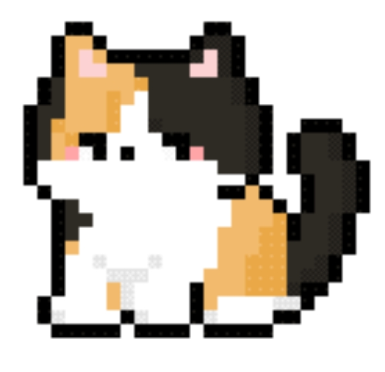
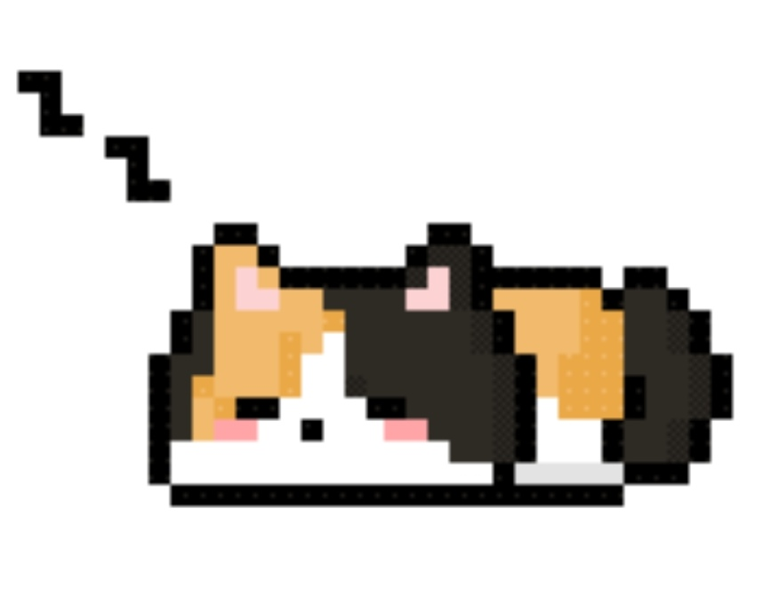
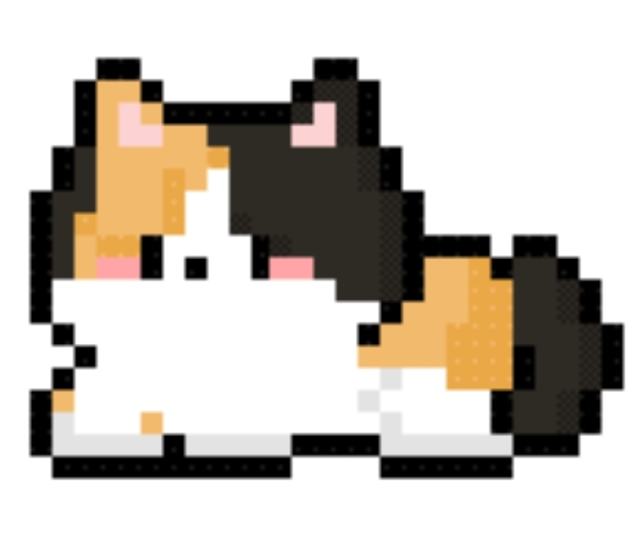
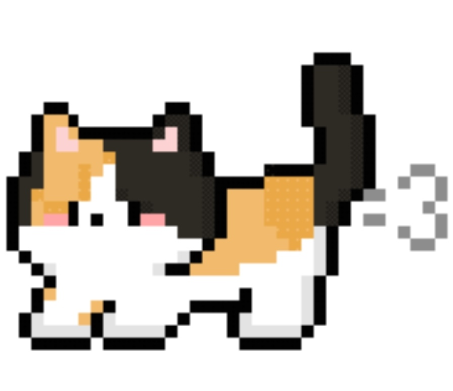

# SmartMate 三花猫桌宠设计

> **需求状态**：已确认。
>
> **实现状态**：三花猫动画资产与 V1 功能均已实现并通过自动化验证。本文同时作为当前行为说明与后续扩展边界，任何修改不得绕过现有任务 Contract 或在 View 中重复业务规则。

## 1. 目标与首版边界

桌宠是任务管理的第二个 View。主任务页面继续提供完整的创建、编辑、筛选、依赖与批量操作；桌宠只把当前进行中任务或 Model 当前最推荐的可执行任务投影成轻量、随手可用的桌面入口。两个 View 必须消费同一份任务计划与状态命令链路，任何一方写入成功后，另一方都通过 Service 失效信号自动刷新。

首版包含：

- 设置页中的“启用桌宠”开关，默认关闭并持久化；
- 普通非最大化窗口上的附着式趴卧桌宠；
- 主窗口最小化后的可拖动悬浮桌宠；
- 当前进行中任务或当前最推荐任务的轻量气泡；
- “开始”“完成”和“打开 SmartMate”三个操作；
- 悬浮位置记忆、跨显示器回退和屏幕边界修正；
- 坐姿与趴卧两组简单像素帧动画。

首版不包含：

- 取消、编辑、归档、依赖管理或批量命令；
- 专注计时、喂养、成长、换装、角色选择或复杂宠物交互；
- 检测其他应用是否处于全屏状态；
- 任务推荐、命令资格或状态机的第二套实现；
- QML、Qt Quick、`QQuickWidget`、GIF 播放器或新的动画运行库。

关闭桌宠后必须立即隐藏所有宠物窗口并停止动画，但保留上次悬浮位置。关闭 SmartMate 进程时，桌宠随应用退出；首版不改变主窗口现有关闭语义，也不引入系统托盘常驻。

## 2. 窗口状态与显示规则

“小窗”固定指 SmartMate 主窗口处于普通、非最小化、非最大化且非 Qt 全屏状态，不使用窗口宽度阈值判断。现有宽度小于 1040 像素的导航收窄规则与桌宠状态互不关联。

| 桌宠设置 | 主窗口状态 | 桌宠形态 |
| --- | --- | --- |
| 关闭 | 任意状态 | 全部隐藏，动画停止 |
| 开启 | 普通窗口 | 靠右附着的趴卧桌宠 |
| 开启 | 最大化 | 隐藏 |
| 开启 | Qt 全屏 | 隐藏 |
| 开启 | 最小化 | 可拖动的悬浮坐姿桌宠 |
| 开启 | 应用退出 | 随应用销毁 |

首版不检测当前前台的其他应用是否全屏。因此 SmartMate 最小化后，悬浮桌宠可能继续显示在全屏视频或游戏之上；该行为属于已接受的首版限制。

### 2.1 普通窗口附着模式

- 桌宠位于主窗口上边缘靠右区域，避开最小化、最大化和关闭按钮；
- 身体主要位于窗口上方，头部和前爪向窗口内部垂入约 8–16 个逻辑像素，形成真实的趴边效果；
- 主窗口移动、缩放、跨屏或 DPI 改变时立即重新定位；
- 主窗口上方空间不足时整体下移并夹紧到当前屏幕可用区域，角色必须保持完整可见；
- 窗口完全鼠标穿透，不夺取焦点，不阻断标题栏拖动或窗口按钮；
- 只跟随主窗口层级，不应作为全局置顶窗口压在其他普通应用之上；
- 不提供点击、拖动或任务交互。

### 2.2 最小化悬浮模式

- 使用无边框、透明、无独立任务栏按钮的置顶窗口；
- 悬浮窗口不能以主窗口为原生 owner，避免随主窗口一起最小化，但其 C++ 生命周期仍由主窗口或组合后的 View 对象树明确管理；
- 用户可以用鼠标左键拖动，拖动过程中不持续写入设置，释放时一次保存最终位置；
- 桌宠始终至少保留完整可见区域，不允许完全拖出任何屏幕的可用区域；
- 单击桌宠切换任务气泡，单击气泡外部或再次单击桌宠关闭气泡；
- 气泡根据剩余屏幕空间在桌宠左侧或右侧展开，并夹紧到当前屏幕可用区域；
- 恢复主窗口、关闭桌宠或进入最大化/全屏后，气泡与悬浮窗口一并隐藏。

## 3. 任务投影与交互

桌宠直接读取现有 `TaskFocusContract`，不得从任务列表行、显示文本或任务状态重新推导焦点身份与命令资格。焦点选择继续由现有计划投影决定：

1. 存在唯一进行中任务时优先显示该任务；
2. 否则显示 Model 推荐顺序中第一项允许开始的任务；
3. 存在待办但全部被依赖阻塞时进入 `AllBlocked`；
4. 没有活动任务时进入 `NoTasks`。

| `FocusState` | 气泡内容 | 首版操作 |
| --- | --- | --- |
| `Suggested` | 标题、推荐理由、截止时间等紧凑信息 | “开始”“打开 SmartMate” |
| `InProgress` | 标题、进行中状态、预计用时等紧凑信息 | “完成”“打开 SmartMate” |
| `AllBlocked` | “当前任务均被前置任务阻塞” | “打开 SmartMate” |
| `NoTasks` | “暂时没有待办任务” | “打开 SmartMate” |

“开始”和“完成”调用 `TaskListContract` 的稳定 `TaskId` 强类型命令。按钮是否可用只绑定 `TaskFocusContract::focusCanStart()` 与 `focusCanComplete()`；Widget 不得根据 `FocusState` 或状态文案自行补算资格。`TaskService` 执行时继续最终复核状态机、依赖和单进行中约束。

命令成功后不在 Widget 中手工改写任务文案，而是沿用以下刷新链路：

```text
桌宠按钮 → TaskListContract 命令 → TaskListViewModel → TaskService
  → Repository 原子写入 → Service 失效信号
  → TaskPlanProjectionSource 刷新 → TaskFocusViewModel 重投影
  → TaskFocusContract 通知 → 桌宠气泡刷新
```

命令失败时，桌宠必须监听任务命令 Contract 的 `notificationRaised`，并在气泡内短暂显示中文错误反馈。主窗口最小化期间不能只依赖主窗口状态栏展示错误。

“打开 SmartMate”只执行 View 层窗口恢复、显示、激活和置前，不经过 Model，也不建立字符串命令或全局事件总线。首版不定义双击桌宠行为。

## 4. 设置、位置与持久化

桌宠偏好不并入 `AppearanceSettings`，当前使用独立纵向切片：

```text
SettingsPage / DesktopPet Window
  → DesktopPetSettingsContract
  → DesktopPetSettingsViewModel
  → DesktopPetSettingsService
  → IDesktopPetSettingsRepository
  → QSettingsDesktopPetRepository
```

`DesktopPetSettings` 是不依赖 Qt Widgets 的普通设置快照，至少包含：

- `enabled`：是否启用桌宠，默认 `false`；
- 可空 `floatingPlacement`：上次悬浮位置；
- `floatingPlacement.screenName`：保存时所在屏幕的稳定名称；
- `floatingPlacement.xRatio`、`yRatio`：相对于该屏幕可用移动范围的归一化坐标，合法范围为 `[0, 1]`。

`DesktopPetSettingsContract` 至少提供当前启用状态、可空位置 getter、启用命令、保存悬浮位置命令、设置变化通知和一次性错误通知。所有方法使用明确的强类型语义，禁止 `execute(QVariant)` 或字符串命令路由。

位置换算属于 View：可用移动范围等于屏幕 `availableGeometry` 减去宠物窗口尺寸，Widget 在拖动释放时计算归一化坐标并通过 Contract 一次提交。Service 负责验证启用值、屏幕名称和有限的 `[0, 1]` 比例，Repository 只负责 `QSettings` 读写。

恢复位置时按以下顺序处理：

1. 保存的屏幕仍存在时，在该屏幕可用区域内恢复并夹紧；
2. 保存的屏幕不存在时，优先使用主窗口最小化前所在屏幕；
3. 无法确定主窗口屏幕时使用主屏幕；
4. 没有已保存位置时，默认放在目标屏幕右下角，距可用区域边缘 24 个逻辑像素。

改变分辨率、缩放、任务栏位置或宠物尺寸时，归一化坐标重新映射到新的可用移动范围。关闭桌宠或恢复主窗口不清除位置。设置页现有“恢复默认外观”只作用于外观设置，不隐式修改桌宠开关或位置；首版不提供单独的“重置桌宠位置”按钮。

SQL 与 SQLite 不得保存桌宠偏好。`QSettings` 只能出现在 `src/model/persistence` 的具体 Repository 中，Widget 和具体 ViewModel 都不得直接访问。

## 5. MVVM 职责与组合

### 5.1 Model

- `DesktopPetSettings`、位置值约束、设置结果和错误分类属于 Model；
- `DesktopPetSettingsService` 只通过 Repository 接口读取和保存完整设置快照；
- 任务推荐、阻塞语义、命令资格和状态转换继续由既有任务 Model 负责；
- 不为桌宠复制任务计划算法，也不把窗口状态、像素位置或动画帧写入任务数据库。

### 5.2 ViewModel Contracts 与实现

- 新增独立的 `DesktopPetSettingsContract` 与具体设置 ViewModel；
- 桌宠的任务信息复用 `TaskFocusContract`，任务写命令复用 `TaskListContract`；
- 不新增只会复制焦点 getter 的 `PetViewModel`；
- 具体桌宠设置 ViewModel 只持有设置快照、映射错误并发布精确通知；
- 任何 ViewModel 都不得包含 `QWidget`、桌面坐标、屏幕对象、透明窗口或动画帧。

### 5.3 Qt Widgets View

当前按职责拆分为以下纯 View 类型：

- `DesktopPetSpriteWidget`：加载图集、切帧、缩放与绘制；
- `AttachedDesktopPetWindow`：窗口边缘定位、鼠标穿透和随主窗口移动；
- `FloatingDesktopPetWindow`：置顶、拖动、位置恢复和屏幕夹紧；
- `DesktopPetTaskPopup`：读取焦点 getter、绑定资格并转发稳定 `TaskId` 命令。

`MainWindow` 只监听自身窗口状态、移动、缩放、屏幕变化和设置通知，再决定显示附着窗口、悬浮窗口或全部隐藏。禁止为这项协调引入 `DesktopPetController`、EventBus、Service Locator 或业务单例。

窗口状态、屏幕几何、锚点、气泡方向、鼠标命中、动画计时和绘制均属于 View。View 只能消费 Contracts，不链接具体 `smartmate_viewmodel`、Service、Repository 或 Persistence。

### 5.4 App 组合根

`AppBootstrapper` 创建桌宠设置 Repository、Service 与具体 ViewModel，并通过 `MainWindowDependencies` 注入：

- `DesktopPetSettingsContract`；
- 既有 `TaskFocusContract`；
- 既有 `TaskListContract`。

组合根负责对象生命周期和具体实现选择，不负责窗口状态判断、图集解析、位置换算或任务规则。

## 6. 三花猫视觉与动画资产

桌宠显示名固定为“三花猫”，稳定资源 ID 为 `calico-cat`。角色保持紧凑、圆润的像素风三花猫造型：观察者左侧脸部以橙色为主，右侧为深黑或深棕色，白色口鼻、胸腹和四肢占较大面积，保留粉色内耳、粗深色像素轮廓和蓬松深色尾巴。

“生动真实”指动作符合猫的身体规律，不表示改为写实渲染。禁止写实毛发、柔和渐变、3D 光照、高细节抗锯齿、投影或复杂粒子。

### 6.1 hatch-pet 图集

已使用 `hatch-pet` 生成 Codex 兼容的完整精灵图：

- 图集尺寸：1536×1872；
- 网格：8 列×9 行；
- 单格：192×208；
- 背景：透明；
- 未使用单元格：完全透明。

生成结果与 QA 证据：

- [canonical base](assets/desktop-pet/generated/calico-cat-canonical-base.png)：角色身份、脸型、三花纹样、色板与尾巴的稳定参考；
- [九行动作接触表](assets/desktop-pet/generated/calico-cat-contact-sheet.png)：逐行检查动作、身份一致性和透明空格；
- [图集结构验证](assets/desktop-pet/generated/calico-cat-validation.json)：1536×1872、8×9、192×208、帧数和透明单元格验证；
- [逐帧 QA 报告](assets/desktop-pet/generated/calico-cat-review.json)：组件提取无错误、无警告；
- [生成摘要](assets/desktop-pet/generated/calico-cat-run-summary.json)：记录最终图集、报告与临时包位置；
- [运行时透明 PNG](../src/view/widgets/pet/assets/calico-cat-spritesheet.png)：已通过 Qt Resource 嵌入 `smartmate_widgets` 并由精灵 Widget 使用。

本轮按约定跳过 MP4 预览，也未安装到用户 Codex 宠物目录。`running-left` 使用同一 canonical base 独立生成，没有从 `running-right` 镜像；最终图集和接触表已人工检查，无白色背景、`Z`、尘烟、文字、阴影、速度线或分离粒子。

SmartMate 首版只消费两行：

| hatch-pet 行 | SmartMate 用途 | 动作要求 |
| --- | --- | --- |
| `idle`（第 0 行） | 最小化悬浮坐姿 | 固定身体底部中心，轻微呼吸、偶尔眨眼和动耳，尾巴缓慢摆动 |
| `waiting`（第 6 行） | 普通窗口趴卧 | 固定腹部与前爪接触线，保持清醒，轻微呼吸、眨眼、动耳或摆动尾尖 |

同一行动画必须保持角色尺寸、基线和锚点一致，禁止用逐帧窗口位移修正资产抖动。动画循环之间可以加入短暂、有限的随机停顿，避免眨眼和次级动作呈现机械周期；随机停顿只影响 View 播放时序，不改变图集或业务状态。

三花纹样明显不对称，`running-left` 不允许从 `running-right` 镜像生成，必须使用同一 canonical base 单独生成。未来可把 `jumping` 用于完成庆祝、`failed` 用于命令失败、`review` 用于任务气泡专注状态，但这些均不属于首版功能验收。

运行时使用最终透明 PNG 并嵌入 Qt Resource，避免新增 WebP 部署插件要求。`DesktopPetSpriteWidget` 使用 Qt Widgets 定时切帧和最近邻缩放；桌宠隐藏时停止定时器。图集加载失败时记录诊断并隐藏桌宠，不得阻止 SmartMate 主程序启动或破坏任务管理功能。

### 6.2 参考素材

以下图片只作为角色身份和姿态参考，不是运行时资源：

| 坐姿与趴卧 | 睡姿与行走 |
| --- | --- |
|  |  |
|  |  |

- 坐姿图是 canonical identity 与悬浮坐姿的主要参考；
- 趴卧图是窗口边缘附着姿态的主要参考；
- 睡姿图只参考闭眼表情和身体收拢方式，左上角“Z”不得进入最终资产；
- 行走图只参考步态和身体比例，右侧灰色尘烟不得进入最终资产；
- 四张图的白色背景必须在生成流程中替换为可清理背景并最终输出完全透明像素；
- 所有动作行必须保持脸型、三花纹样、身体比例、尾巴形状、色板和轮廓粗细一致。

## 7. 实施阶段与验收

### 阶段 1：设置纵向切片

- 实现普通设置类型、Repository 接口、QSettings Adapter、Service、Contract 与具体 ViewModel；
- 在设置页加入默认关闭的开关；
- 覆盖默认值、保存失败、损坏值回退、设置通知和关闭后保留位置。

完成标准：Widget 只通过 `DesktopPetSettingsContract` 读写，QSettings 不越过 Persistence。

### 阶段 2：窗口与位置

- 实现附着窗口、悬浮窗口、状态切换和位置记忆；
- 覆盖普通、最小化、最大化、Qt 全屏、跨屏、DPI 变化、屏幕移除和上边缘空间不足；
- 验证附着窗口鼠标穿透、悬浮窗口可拖动且不会丢失到屏幕外。

完成标准：设置状态和主窗口状态矩阵全部符合第 2 节，两个宠物窗口不同时可见。

### 阶段 3：任务气泡与命令

- 使用 `TaskFocusContract` 构建四种焦点状态；
- 使用 `TaskListContract` 转发开始与完成命令；
- 展示命令失败通知并在成功后依靠共享计划投影刷新；
- 恢复、激活主窗口的操作保持在 View。

完成标准：Fake Contract 测试记录稳定 `TaskId`，Widget 不推导资格、不调用具体 ViewModel，主窗口和桌宠双向同步。

### 阶段 4：三花猫资产与动画

- 使用本文件的四张参考图和 `hatch-pet` 生成 canonical base、完整动作行、透明图集、接触表和预览视频；
- 对帧数、透明单元格、裁剪、固定锚点、身份一致性、禁止效果和左右非镜像逐项 QA；
- 将验收通过的透明 PNG 纳入 Qt Resource，并只启用首版两行动画。

完成标准：图集尺寸和行协议正确，坐姿与趴卧循环无抖动、无背景、无字符、无尘烟，隐藏时不消耗动画计时。

### 阶段 5：集成与发布

- 在组合根完成显式注入并补充架构守卫；
- 使用 Widget Fake Contracts、ViewModel/Model 测试和内存 SQLite 集成测试验证完整链路；
- 运行 Debug 全量测试、正式入口目标、Widgets 筛选测试和 Release 部署验证。

最终验收命令：

```powershell
cmake --preset debug
cmake --build --preset debug
ctest --preset debug --output-on-failure
cmake --build --preset debug --target SmartMate
ctest --preset debug --output-on-failure -R "view.widgets|integration.widgets"
powershell -NoProfile -ExecutionPolicy Bypass -File .\scripts\deploy.ps1 -Configuration Release
```

发布目录不得新增 QML/Quick 运行库、插件或 `qml/` 目录。桌宠资产或窗口初始化失败不得影响任务、依赖图、统计和设置页面的正常使用。
